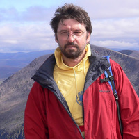

### Keynote Talks

- [Michael Zakharyaschev](https://titan.dcs.bbk.ac.uk/~michael/), Birkbeck, University of London, UK

Michael Zakharyaschev is a Professor of Computer Science in the School of Computer Science and Information Systems at Birkbeck College, University of London. His current research interests include mathematical and computational aspects of knowledge representation and reasoning using modal, temporal, description, spatial, metric, intuitionistic, etc., logics as well as those logics per se.
  
- [Michael Wooldridge](https://www.cs.ox.ac.uk/people/michael.wooldridge/), University of Oxford, UK

Michael Wooldridge is a Professor of Computer Science at the University of Oxford. His main research interests is in multi-agent systems, and in particular, in the computational theory aspects of rational action in systems composed of multiple self-interested agents. His work is characterised by the use of techniques from computational logic, game theory, and social choice theory.

### Schedule

- TBA
