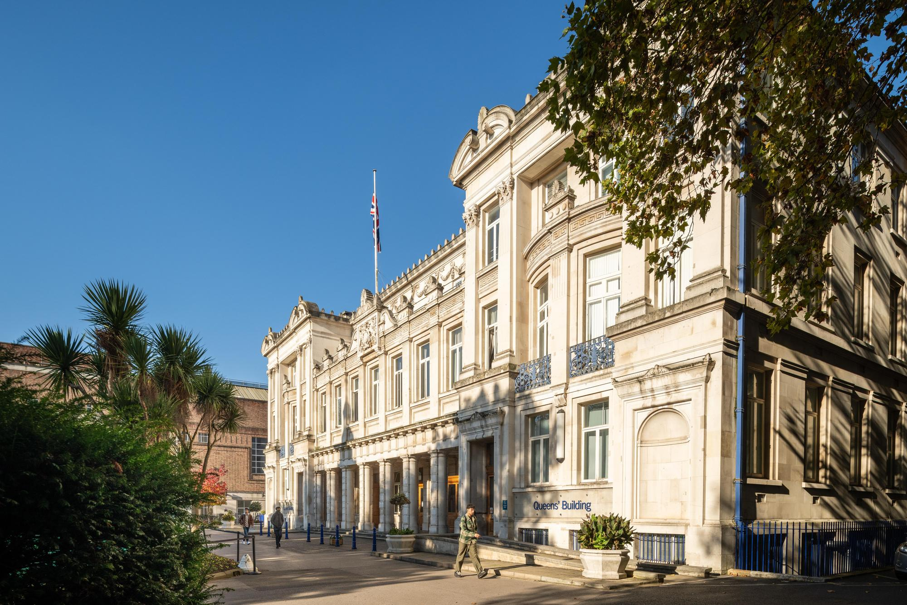

## Queen Mary University of LondonQueen Mary University of London

TIME 2025 will take place in the [Mile End campus](https://www.qmul.ac.uk/about/howtofindus/mileend/index.html) of Queen Mary University of London.

All the talks will take place in **Peston Lecture Theatre** at the New Graduate Centre - building n.18 in this [campus map](https://assets.qmul.ac.uk/docs/about/26065.pdf).

The closest tube stations are **Stepney Green** and **Mile End**. For travel planning to the venue we recommend using the "directions" option in this [google map](https://maps.app.goo.gl/UdAfrhAvDUUkefqS6). You can use the postal code E1 4DQ to locate the campus. 

The easiest and generally best value way to pay for all public transport in London (TFL) is using a contactless bank card or mobile device.

## Accommodation

Accommodation on Queen Mary campus, where the conference will take place, are provided by
- [Stay QM](https://www.qmaccommodation.co.uk/)

Other accommodation options reachable on foot (or by public transport) include:
- [Travelodge Bethnal Green](https://www.travelodge.co.uk/hotels/571/London-Bethnal-Green-hotel) (£)
- [Ibis Budget London Whitechapel](https://all.accor.com/hotel/8033/index.en.shtml?utm_term=mar&gclid=CjwKCAjwp8--BhBREiwAj7og1yhfYyrFg5RyVt6dWaiEb2Q5ptX-ikiNHziv6oNthNDLwY3fREafkRoCdncQAvD_BwE&utm_campaign=ppc-ibb-mar-goo-uk-en-uk_ai-mix-sear&utm_medium=cpc&utm_content=uk-en-GB-V2352&utm_source=google) (£)
- [The Whitechapel Hotel](https://thewhitechapelhotel.com/) (££)
- [Holiday Inn Commercial Road](https://holidayinn.reservationscenter.com/hotel/holiday-inn-london-whitechapel-an-ihg-hotel-5-cavell-street-london?modal&gad_source=1&gclid=CjwKCAjwp8--BhBREiwAj7og14LC7fLi7-2nk7kW2BJTy9bA60hOTe0X0MoHWMX6BXQxH1ngMqb5RRoCRzoQAvD_BwE) (££)
- [Town Hall Hotel](https://www.townhallhotel.com/home) (£££)
